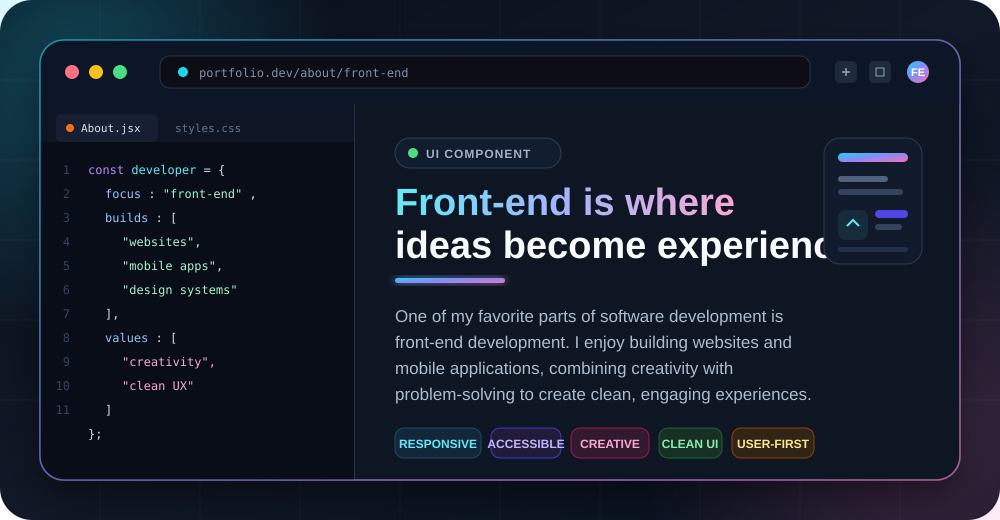

  

   
   
  

---

I am Dimitar, known online as "pishtov." My interest in computers began at a young age, and as I grew older, this curiosity evolved from casual use—playing games or watching videos—into a genuine desire to understand how computer systems function at a fundamental level.

---

I completed my secondary education with a focus on programming in C++, which strengthened my interest in the field. Several years later, I earned a Bachelor's degree in Communication Technologies and Cybersecurity. This marked a turning point, as it broadened my perspective and deepened my enthusiasm for software development, networking, and cybersecurity.
I am currently continuing my studies in this field while working on personal projects to apply what I learn in practice. Although I am still building my skills and experience, each project contributes to a stronger understanding of the subject and brings me closer to my long-term goals in the industry.

---

  

---

You can reach me on LinkedIn:

Currently comfortable with

     

---

Also interested in
- Capture The Flag challenges
- Cybersecurity and network security
- Systems and programming
- Software development and clean architecture
- Reverse engineering and problem solving
- Continuous learning and personal projects

  

